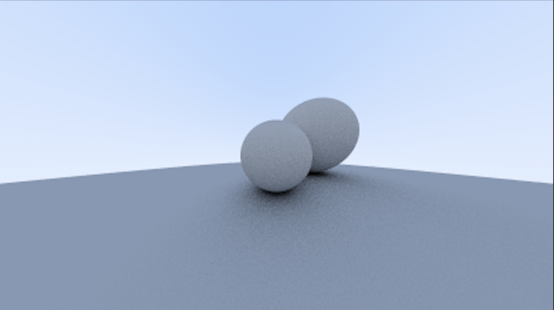

# Ray Tracing

A minimal C++ project to understand ray tracing conceps.

## Build

```sh
cmake -B build -DCMAKE_BUILD_TYPE=Release
cmake --build build
```

## Run

```sh
build/render > image.ppm
```

Open `image.ppm` with any PPM-compatible image viewer.

## Output: Till now.


> Source : [Ray Tracing in One Weekend](https://raytracing.github.io/books/RayTracingInOneWeekend.html)
